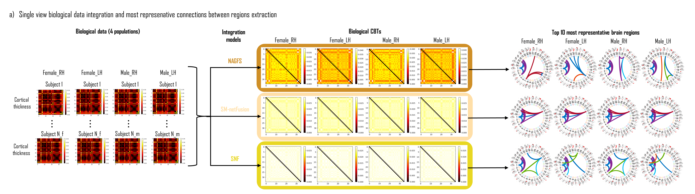
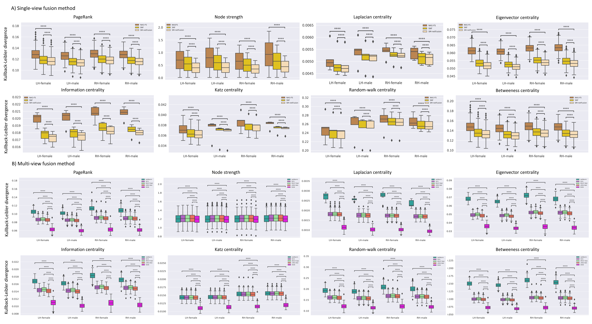

# Comparative Survey of Multigraph Integration Methods for Holistic Brain Connectivity Mapping

> [Nada Chaari](https://github.com/Nada-Chaari-ITU)<sup>1,2</sup>, [Hatice Camgöz Akdağ]<sup>2</sup>, [Islem Rekik](https://basira-lab.com/)<sup>1</sup>
> <sup>1</sup>BASIRA Lab, Faculty of Computer and Informatics, Istanbul Technical University, Istanbul, Turkey
> <sup>2</sup>Faculty of Management Engineering, Istanbul Technical University, Istanbul, Turkey

> **Abstract:** *One of the greatest scientific challenges in network neuroscience is to create a representative map of a population of heterogeneous brain networks, which acts as a connectional fingerprint. The connectional brain template (CBT), also named network atlas, presents a powerful tool for capturing the most representative and discriminative traits of a given population while preserving its topological patterns. The idea of a CBT is to integrate a population of heterogeneous brain connectivity networks, derived from different neuroimaging modalities or brain views (e.g., structural and functional), into a unified holistic representation. Here we review current state-of-the-art methods designed to estimate well-centered and representative CBT for populations of single-view and multi-view brain networks. We start by reviewing each CBT learning method, then we introduce the evaluation measures to compare CBT representativeness of populations generated by single-view and multigraph integration methods, separately, based on the following criteria: centeredness, biomarker-reproducibility, node-level similarity, global-level similarity, and distance-based similarity. We demonstrate that the deep graph normalizer (DGN) method significantly outperforms other multi-graph and all single-view integration methods for estimating CBTs using a variety of healthy and disordered datasets in terms of centeredness, reproducibility (i.e., graph-derived biomarkers reproducibility that disentangle the typical from the atypical connectivity variability), and preserving the topological traits at both local and global graph-levels. Our code is available at https://github.com/basiralab/survey-multigraph-integration-methods.*

# Introduction

>**A connectional brain template (CBT)** is an integral graph-based fingrprint of a population of brain networks also regarded as an average connectome. CBTs are powerful tools for creating representative maps of brain connectivity, disentangling the typical from the atypical variations across the population samples. Estimating a well-centered and discriminative CBT for populations of heterogenous brain networks such as structural, functional, and morphological networks is more challenging since these networks sit on complex manifolds and there is no easy way to fuse them. Thus, we list here all papers of 7 years (2014-2020), some journals, and MICCAI (2019-2020) papers that fuse multiple brain network and identify biomarkers (distinctive connectivities fingerprinting) of different population such as healthy and disordered populations. The existing fusion models embedded in the papers are basing on:
* [geometric deep learning multi-view graph network normalization](#MultiGraph)
* [deep learning cluster-based graph network integration](#MultiGraph)
* [manifold optimization clustering-based network integration](#MultiGraph)
* [machine learning cluster-based network fusion](#singleView)


<p align="center">
  
</p>


If you like to update the file by adding the unlisted open-source articles, feel free to open an issue or submit a pull requests. You can also directly contact Nada Chaari at chaari17@itu.edu.tr. All contributions are very welcome! 

<a name="MultiGraph" />

# Graph integration and fusion 

## Multi-graph integration
| Title                                                        | Paper | Author | Dataset | Code | Youtube Video |  Proceeding/Journal/Year |
|:------------------------------------------------------------:|:----------------------:|:----------------------:|:----------------------:|:----------------------:| :----------------------:|:----------------------: 
| Deep Graph Normalizer: A Geometric Deep Learning Approach for Estimating Connectional Brain Templates | [ARXIV](https://arxiv.org/pdf/2012.14131.pdf)  | Mustafa Burak Gurbuz |  [ADNI 3](http://adni.loni.usc.edu/)  | [Python](https://github.com/basiralab/DGN) | [10 min](https://www.youtube.com/watch?v=Q_WLY2ZNxRk) | MICCAI 2020 | 
| Clustering-Based Deep Brain MultiGraph Integrator Network for Learning Connectional Brain Templates| [LNCS](https://link.springer.com/chapter/10.1007/978-3-030-60365-6_11) | Ugur Demir| [ABIDE](http://fcon_1000.projects.nitrc.org/indi/abide/)   | [Python](https://github.com/basiralab/cMGINet) | __ | GRAIL MICCAI 2020|
| Estimation of Gender-Specific Connectional Brain Templates using Joint Multi-View Cortical Morphological Network Integration | [LNCS](https://link.springer.com/article/10.1007/s11682-020-00404-5)  | Nada Chaari | [GSP](https://dataverse.harvard.edu/dataset.xhtml?persistentId=doi:10.7910/DVN/25833)   | __ | __ | Brain Imaging and Behavior 2020|
| Estimation of Connectional Brain Templates using Selective Multi-View Network Normalization | [ScienceDirect](https://www.sciencedirect.com/science/article/pii/S1361841519301070)  | Salma Dhifallah |  [ABIDE](http://fcon_1000.projects.nitrc.org/indi/abide/)   | [Python](https://github.com/basiralab/netNorm-PY) | __ | Medical Image Analysis 2020|
| Clustering-based multi-view network fusion for estimating brain network atlases of healthy and disordered populations | [ScienceDirect](https://reader.elsevier.com/reader/sd/pii/S0165027018302954?token=C0FB1190D50158892D415B658E92752EBA2C2BCC282D226E9B3BC55F160D853C4FD8D15E0F796D1E64E3D4F51C54A76F&originRegion=eu-west-1&originCreation=20210630085236)  |  Salma Dhifallah |  [ADNI 3](http://adni.loni.usc.edu/)  | __ | __ |  Neuroscience Methods 2019

<a name="singleView" />

## Single-graph integration

| Title                                                        | Paper | Author | Dataset | Code | Youtube Video | Proceeding/Journal/Year |
|:------------------------------------------------------------:|:----------------------:|:----------------------:|:----------------------:|:----------------------:| :----------------------:|:----------------------:  
| Supervised Multi-topology Network Cross-diffusion for Population-Driven Brain Network Atlas Estimation | [LNCS](https://link.springer.com/chapter/10.1007/978-3-030-59728-3_16)  | Islem Mhiri | [ADNI](https://link.springer.com/chapter/10.1007/978-3-030-59728-3_17) [ABIDE](http://fcon_1000.projects.nitrc.org/indi/abide/) | [Python]( https://github.com/basiralab/SM-netFusion-PY) | [5min](https://www.youtube.com/watch?v=-dDn8CT4mH0) | MICCAI 2020  
| Joint Functional Brain Network Atlas Estimation and Feature Selection for Neurological Disorder Diagnosis With Application to Autism | [ScienceDirect](https://www.sciencedirect.com/science/article/pii/S1361841519301367)  | Islem Mhiri | [ABIDE](http://fcon_1000.projects.nitrc.org/indi/abide/)   | [Python]( https://github.com/basiralab/NAGFS-PY) | __ | Medical Image Analysis 2019
| Similarity network fusion for aggregating data types on a genomic scale | [LNCS](https://www.nature.com/articles/nmeth.2810.pdf)  | Bo Wang  | [TCGA](https://www.cancer.gov/about-nci/organization/ccg/research/structural-genomics/tcga/using-tcga/technology)  | [Python](https://github.com/rmarkello/snfpy) | __ | Nature Methods 2014

# Evaluation strategy

The diagram below illustrates the criteria used to evaluate the performance of the connectional brain templates generated for single-view graph integration methods and multi-view graphs fusion methods. This includes first graph centeredness using Frobenius distance, second, the graph-derived biomarker reproducibility where we identify the overlap of top k discriminative nodes (ROIs) computed by the graph fusion methods and by an independent biomarker selection method, third the global-level similarity using both modularity and global efficiency measures, fourth the graph distance-based similarity where we compute Hamming and Jaccard distances. Finally, we include the graph node-wise similarity where we evaluate three behavior for the graph: integration behavior using participation coefficient, segregation behavior using local efficiency, and hubness behavior using the following centrality metrics: PageRank (Xing et al., [2004](https://ieeexplore.ieee.org/abstract/document/1344743?casa_token=aAa34BUAwbUAAAAA:6CR5vikAH2k1yRB71SBuOB4Fqfv5yjMPVe1vCWaFVdZkKezwQ12gNAxfyzsuhak0unBKUkTF)), Katz centrality (Katz et al., [1953](https://link.springer.com/content/pdf/10.1007/BF02289026.pdf)), node strength (Barrat et al., [2004](https://www.pnas.org/content/101/11/3747.short)), random-walk centrality (Newman et al., [2005](https://www.sciencedirect.com/science/article/pii/S0378873304000681?casa_token=iaSozcruXUUAAAAA:PL_Z4eYWiiFEG7e2ywT0C-nExhALJmwYUSjTBv_atVIB0cohyuimRw_vN9reSFounCW8-BOD)), information centrality (Stephenson et al., [1989](https://www.sciencedirect.com/science/article/abs/pii/0378873389900166)), Laplacian centrality (Qi et al., [2012](https://www.sciencedirect.com/science/article/pii/S0020025511006761?casa_token=lYprxjd02QMAAAAA:0JPssbzFOMqkiH7tzI2HkOcb-kSKckBrPc3c3x3-KQEiMz6WhIRu6TEwef_KSjFKaLjmgFHB)), eigenvector centrality (Newman et al., [2008](http://citeseerx.ist.psu.edu/viewdoc/download?doi=10.1.1.131.8175&rep=rep1&type=pdf)), and betweeness centrality (Brandes et al., [2001](https://www.tandfonline.com/doi/abs/10.1080/0022250x.2001.9990249?casa_token=uRBF4oWSl9cAAAAA:vkvJIX6d2PX-g2F1j9EEadUKa_fdNy1zm48htKildQMOgAaIFtCXIUCNk_7LruO1TCLp8hh7GaE)).

<p align="center">
  
</p>

# Data format
We run a connectomic dataset which consists of 308 human male subjects (M) and 391 human male subjects (F) from the Brain Genomics Superstruct Project (GSP) dataset (Holmes et al., [2015] ( https://www.nature.com/articles/sdata201531/fig_tab )). Each subject is represented by 4 cortical morphological brain networks (Nebli et al., [2020] ( https://link.springer.com/article/10.1007/s11682-019-00123-6 )) derived from maximum principal curvature, mean cortical thickness, mean sulcal depth, and average curvature measurements. For each hemisphere, the cortical surface is reconstructed from T1-weighted MRI using FreeSurfer pipeline (Fischl et al., [2012] ( https://pubmed.ncbi.nlm.nih.gov/22248573/ ))and parcellated into 35 cortical regions of interest (ROIs) using Desikan-Killiany cortical atlas (Desikan et al., [2006] ( https://www.sciencedirect.com/science/article/pii/S1053811906000437?casa_token=_b-7Vr1dT9gAAAAA:5OoJBGcMy2AUtVzRGlHtxggoUjIwiMA5H_UFxxiV0ST4WckwB5Zbnv7RwYyO5INXqYnJ-v2S )). The corresponding connectivity strength between two ROIs is derived by computing the absolute difference in their average cortical attribute (e.g., thickness).

Note that we use 4 cortical morphological brain networks as to compare between multi-graph fusion methods, while we use 1 cortical morphological brain network (cortical thickness) to compare between single-view integration methods. Each subject of single-view brain networks dataset can be represented as an adjacency matrix with shape
```
[num_ROIs x num_ROIs]
```
where `num_ROIs` is number of region of interests in the brain graph, thus, single-view brain networks dataset can be represented as a stacked adjacency matrices with shape
```
[num_Subs x num_ROIs x num_ROIs]
```
where num_sub is number of subjects in a dataset. In the case of multi-graph fusion, each subject of multi-view brain networks dataset can be represented as a stacked adjacency matrices with shape
```
[num_ROIs x num_ROIs x num_Views]
```
where `num_views` is number of cortical morphological brain networks, called also views (eg.cortical thickness), thus, multi-view brain networks dataset can be represented as a stacked adjacency matrices with shape
```
[num_Subs x num_ROIs x num_ROIs x num_Views]
```
# Code 

* First, install the codes of all single-view fusion methods(SNF, NAG-FS, SM-NetFusion) and multi-graph fusion methods (SCA, netNorm, MVCF-Net,cMGINet, DGN) (the links sources are available in the table above. From the column 'Code', click on the link).
* Second, create single-view dataset with dimension shape `[num_Subs x num_ROIs x num_ROIs]` and multi-view dataset with dimension shape `[num_Subs x num_ROIs x num_ROIs x num_Views]`
* Third, use k-folds cross-validation to divide each dataset into training dataset and testing dataset. 
* Then, train fusion methods using multi-view training dataset and single-view training dataset, separately, to learn how to integrate single-view graph networks-based dataser into a unique templates, called CBTs.
* Next, use the trained fusion methods to generate the CBTs using multi-view testing dataset and single-view testing dataset, separately. We also generate the ground truths representing multi-view testing dataset and single-view testing dataset by averaging all multi-view graph networks testing subjects and all single-view graph networks testing subjects, separately.
* Finally, evaluate the performance of generated CBTs in terms of CBT centeredness, biomarker reproducibility, node-wise similarity, global-level similarity, and distance-based similarity, as illustrated by the figure above in evaluation strategy section. As evaluation measures, we compute at the node-graph scale 8 topological measures (betweeness centrality, eigenvector centrality, PageRank, etc...), local efficiency, and participation coefficient metrics. At the global-graph level, we compute the pre-mentioned 8 topological measures over the ROIs, Frobenius distance, Kullback-Leibler divergence, graph modularity, local efficiency, and global efficiency metrics. Additionally, we compute the KL-divergence, Hamming distance, and Jaccard distance measures on all pairs graph fusion methods.

**Note** : The zip folders entitled 'Reproducibility of the plots for multi-view fusion methods.zip' and 'Reproducibility of the plots for single-view fusion methods' above provide all codes to reproduce the evaluation results (topological measures, KL-divergence, Frobenius distance, local efficiency, etc...) and which are displayed in the file entitled Plots.zip above to compare the integration performance of single-view and multi-graph fusion methods, sepeartely.

# Installation

* The required installation for each fusion method is available when you click on the link in the column 'Code' of the table above.
* To run our codes in zip folders above entitled 'Reproducibility of the plots for multi-view fusion methods.zip' and 'Reproducibility of the plots for single-view fusion methods', you need other dependencies which can be installed via:
```sh
$pip install numpy
$pip install scipy
$pip install seaborn
$pip install pandas
$pip install matplotlib
```
# Example Result

* The figure below demonstrates the biological CBTs estimated by multigraph integration methods including multi-view networks normalizer (netNorm) (Dhifallah et al., [2020](https://www.sciencedirect.com/science/article/pii/S1361841519301070)), cluster-based network fusion (SCA) (Dhifallah et al., [2019](https://pubmed.ncbi.nlm.nih.gov/30282004/)), multi-view clustering and fusion (MVCF-Net) (Chaari et al., [2020](https://www.ncbi.nlm.nih.gov/pmc/articles/PMC8413178/)), cluster-based multi-graph integrator networks (cMGI-Net) (Demir et al., [2020](https://link.springer.com/chapter/10.1007/978-3-030-60365-6_11)), and deep graph normalizer (DGN) (Gurbuz et al., [2020](https://arxiv.org/abs/2012.14131)) for the left hemisphere (LH) and the right hemisphere (RH) of the female group (F) and male group (M) along with view averages. It is apparent that the templates generated by DGN encapsulate topological patterns which commonly exist in all views of all subjects of each group (eg., LH-F, LH-M, RH-F, RH-M) represented by multi-view brain networks. As for other multigraph fusion methods, they capture only a few local motifs across views. The figure further demonstrates circular graphs illustrating the top 10 most representative cortical morphological connections between brain regions having the highest weights, of male and female brain networks groups, respectively, for both right and left hemispheres, thereby emphasizing the most discriminative and representative edges used as population fingerprints of multi-view brain networks.

<p align="center">
  
</p>

* The figure below represents the average of Kullback-Liebler divergence distribution across 5-fold cross validation between the ground truth distribution and the average topological distributions of the learned connectional templates generated by *A* single-view fusion methods (SNF (Wang et al., [2014](https://www.nature.com/articles/nmeth.2810?source=post_page---------------------------)), NAG-FS (Mhiri et al., [2020](https://www.sciencedirect.com/science/article/pii/S1361841519301367?casa_token=_LjQLfUqgwIAAAAA:C_CCgChD-aedW-g3nQdtGcgCCB46RJ-9KgDm3PrXQfIFvNgxvn2zD1jDARL5VvNXEoCgHuwj)), and SM-netFusion (Mhiri et al., [2020](https://link.springer.com/chapter/10.1007/978-3-030-59728-3_17))); and *B* multigraph fusion methods (netNorm (Dhifallah et al., [2020](https://www.sciencedirect.com/science/article/pii/S1361841519301070)), SCA (Dhifallah et al., [2019](https://pubmed.ncbi.nlm.nih.gov/30282004/)), MVCF-Net (Chaari et al., [2020](https://www.ncbi.nlm.nih.gov/pmc/articles/PMC8413178/)), cMGI-Net (Demir et al., [2020](https://link.springer.com/chapter/10.1007/978-3-030-60365-6_11)), and DGN (Gurbuz et al., [2020](https://arxiv.org/abs/2012.14131))). The topological measures include PageRank (Xing et al., [2004](https://ieeexplore.ieee.org/abstract/document/1344743?casa_token=aAa34BUAwbUAAAAA:6CR5vikAH2k1yRB71SBuOB4Fqfv5yjMPVe1vCWaFVdZkKezwQ12gNAxfyzsuhak0unBKUkTF)), Katz centrality (Katz et al., [1953](https://link.springer.com/content/pdf/10.1007/BF02289026.pdf)), node strength (Barrat et al., [2004](https://www.pnas.org/content/101/11/3747.short)), random-walk centrality (Newman et al., [2005](https://www.sciencedirect.com/science/article/pii/S0378873304000681?casa_token=iaSozcruXUUAAAAA:PL_Z4eYWiiFEG7e2ywT0C-nExhALJmwYUSjTBv_atVIB0cohyuimRw_vN9reSFounCW8-BOD)), information centrality (Stephenson et al., [1989](https://www.sciencedirect.com/science/article/abs/pii/0378873389900166)), Laplacian centrality (Qi et al., [2012](https://www.sciencedirect.com/science/article/pii/S0020025511006761?casa_token=lYprxjd02QMAAAAA:0JPssbzFOMqkiH7tzI2HkOcb-kSKckBrPc3c3x3-KQEiMz6WhIRu6TEwef_KSjFKaLjmgFHB)), eigenvector centrality (Newman et al., [2008](http://citeseerx.ist.psu.edu/viewdoc/download?doi=10.1.1.131.8175&rep=rep1&type=pdf)), and betweeness centrality (Brandes et al., [2001](https://www.tandfonline.com/doi/abs/10.1080/0022250x.2001.9990249?casa_token=uRBF4oWSl9cAAAAA:vkvJIX6d2PX-g2F1j9EEadUKa_fdNy1zm48htKildQMOgAaIFtCXIUCNk_7LruO1TCLp8hh7GaE)). Charts illustrate that for multi-graph fusion methods comparison, DGN achieved the minimum mean KL-divergence distribution and the narrowest dispersion range with a high statistical significance demonstrated by a two-tailed paired t-test (all p < 0.0001) for DGN-SCA, DGN-netNorm, DGN-MVCFNet, and DGN-cMGI-Net pairs for F-LH, F-RH, M-LH and M-RH groups. For single-view fusion methods comparison, SM-netFusion significantly achieved the lowest mean KL-divergence distribution to the population single-view networks (all p < 0.0001) using two-tailed paired t-test for SM-netFusion-NAGFS, and SM-netFusion-SNF pairs for F-LH, F-RH, M-LH and M-RH datasets. [Box plot legend: median (midline), box (25th and 75th percentiles), and whiskers (extrema).]

<p align="center">
  
</p>

# arXiv Paper Link for Citation

https://arxiv.org/abs/2204.05110

```latex
@article{chaari2022,
  title={Comparative survey of multigraph integration methods for holistic brain connectivity mapping},
  author={Chaari, Nada and Akda{\u{g}}, Hatice Camg{\"o}z and Rekik, Islem},
  journal={Medical Image Analysis},
  pages={102741},
  year={2023},
  publisher={Elsevier}
}
```
